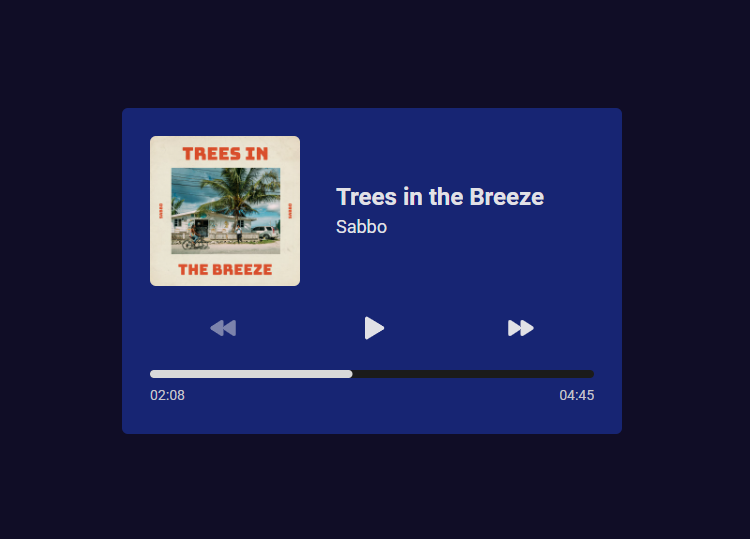

<h1 align="center">Music Player 🎼</h1>

  

 
<h2>🎹 Sobre</h2>

Desafio proposto no evento <a href="https://boracodar.dev/">BoraCodar</a>, organizado pela Rocketseat. O desafio era criar um player de música, contendo as funcionalidades de tocar, pausar e alternar as músicas, além de exibir a barra de progresso de acordo com o tempo de duração da mesma.

 
<h2>🎯 Objetivo</h2>

Utilizei este desafio para treinar estilização responsiva utilizando Tailwind, além de entender e aplicar na prática a manipulação do construtor de Aúdio da DOM.

 
<h2>🛠️ Tecnologias e ferramentas/bibliotecas utilizadas</h2>
<ul>
  <li><a href="https://pt-br.reactjs.org/">React</a></li>
  <li><a href="https://www.typescriptlang.org/">Typescript</a></li>
  <li><a href="https://tailwindcss.com/">TailwindCSS</a></li>
</ul>
 
<h2>🔖 Layout</h2>

Você pode visualizar o layout do projeto através deste link: <a href="https://www.figma.com/file/RPqg31bKEybNkRulU2C75Y/%23boraCodar---Desafio-1-(Copy)?node-id=0%3A1">Layout do projeto</a>. É necessário possuir uma conta no <a href="https://figma.com">Figma</a> para acessá-lo.

 
 

Made by Matheus Pazinati 🛸
